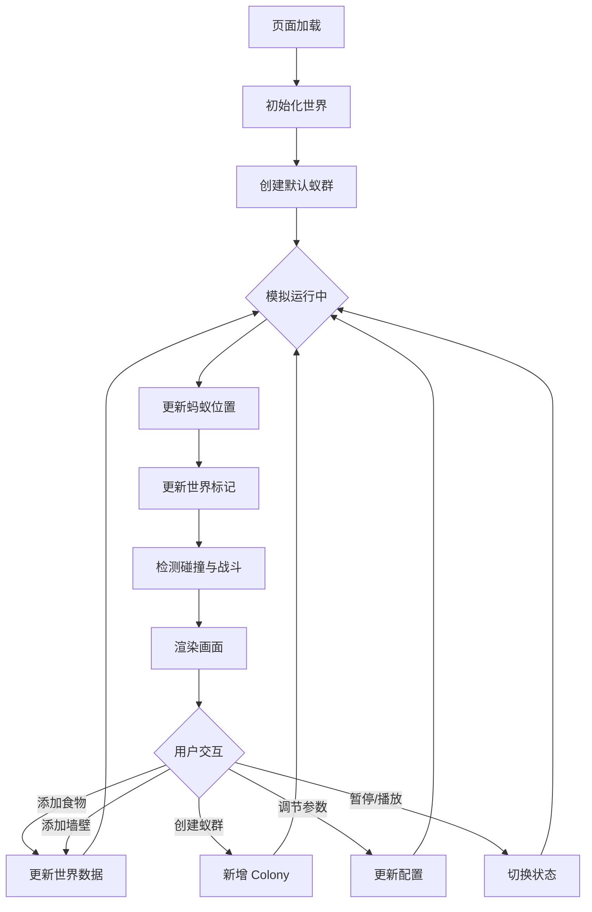
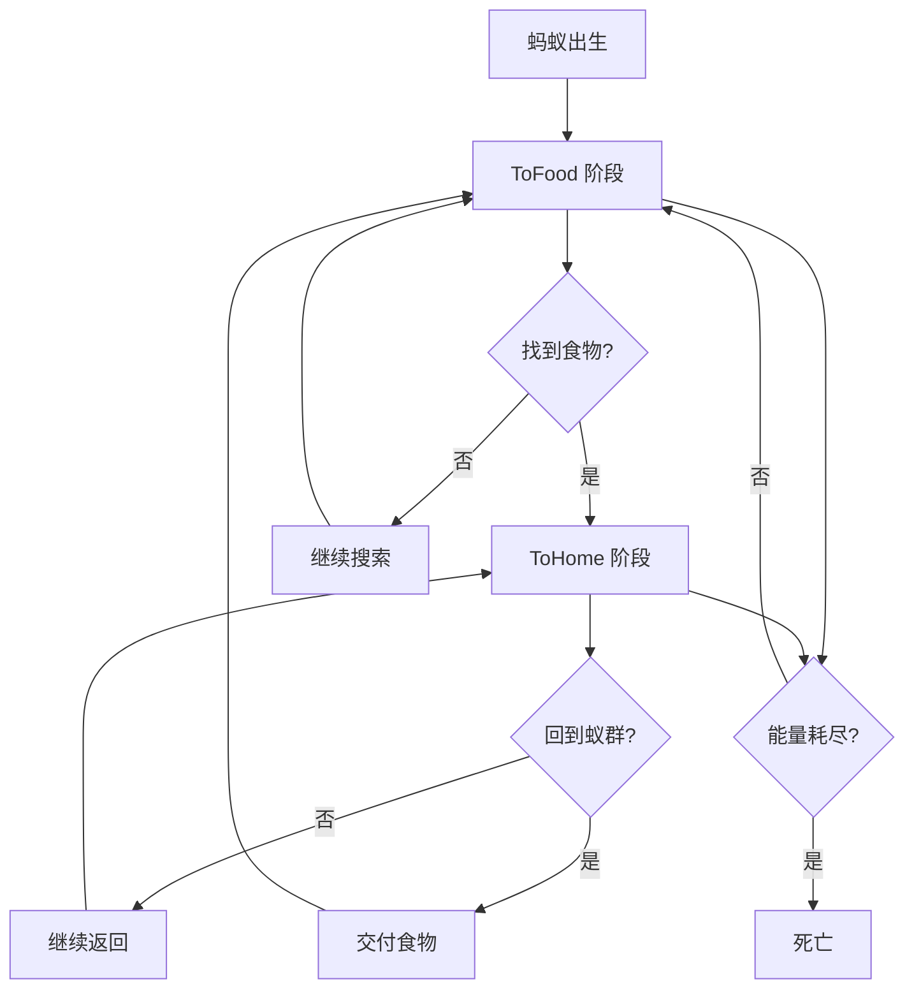

# AntSimulator Web 版 - 产品需求文档

## 1. 产品概述

AntSimulator Web 是一个基于浏览器的蚂蚁行为模拟器，将原 C++/SFML 版本重写为 Web 技术栈。它模拟多蚁群在二维世界中的觅食、路径标记、蚁群间战斗等行为，提供实时可视化和交互式编辑功能。

- 目标用户：生物学爱好者、模拟仿真研究者、编程学习者
- 核心价值：零安装、跨平台、实时交互的蚂蚁群体智能模拟

## 2. 核心功能

### 2.1 功能模块

1. **模拟主页面**：实时蚂蚁模拟渲染、交互控制、参数调节
2. **编辑器面板**：地图编辑、蚁群管理、显示选项

### 2.2 页面详情

| 页面名称 | 模块名称 | 功能描述 |
|---------|---------|---------|
| 模拟主页面 | 世界渲染区 | Canvas 渲染蚂蚁、标记、食物、墙壁，支持缩放和平移 |
| 模拟主页面 | 控制面板 | 暂停/播放、速度控制、显示选项切换 |
| 模拟主页面 | 编辑工具 | 墙壁绘制/擦除、食物放置、蚁群创建/删除 |
| 模拟主页面 | 蚁群信息 | 各蚁群统计数据（蚂蚁数量、食物储备、兵蚁比例） |
| 模拟主页面 | 参数调节 | 蚂蚁数量、标记强度、移动速度等参数实时调节 |

## 3. 核心流程

### 3.1 模拟主循环

用户打开页面 → 初始化世界和默认蚁群 → 主循环（更新模拟 → 渲染画面）→ 用户交互（添加食物/墙壁/蚁群）→ 实时反馈

### 3.2 蚂蚁行为流程

## 4. 用户界面设计

### 4.1 设计风格

- **主色调**：深色自然主题（深绿/棕色背景），强调自然生态感
- **辅助色**：蚁群标识色（红、蓝、黄、青）
- **按钮风格**：圆角半透明玻璃态按钮
- **字体**：等宽字体用于数据展示，无衬线字体用于 UI 标签
- **布局**：左侧主画布 + 右侧工具面板
- **图标风格**：线性图标（lucide-react）

### 4.2 页面设计概览

| 页面名称 | 模块名称 | UI 元素 |
|---------|---------|---------|
| 模拟主页面 | 世界渲染区 | 全屏 Canvas，深色背景，蚂蚁/标记/食物实时渲染 |
| 模拟主页面 | 控制面板 | 播放/暂停按钮、速度滑块、FPS 显示 |
| 模拟主页面 | 编辑工具 | 工具选择按钮组（食物/墙壁/擦除/蚁群）、画笔大小滑块 |
| 模拟主页面 | 蚁群信息 | 蚁群卡片列表，显示颜色标识、蚂蚁数、食物量、兵蚁数 |
| 模拟主页面 | 显示选项 | 开关切换：蚂蚁/标记/密度显示 |
| 模拟主页面 | 参数面板 | 滑块：蚂蚁数量、标记强度、移动速度 |

### 4.3 响应式设计

- 桌面优先设计，主画布占据大部分空间
- 右侧面板可折叠，小屏幕时自动收起
- 触摸设备支持：双指缩放、单指平移、长按添加食物

### 4.4 快捷键

| 按键 | 功能 |
|------|------|
| P / Space | 暂停/继续模拟 |
| M | 显示/隐藏路径标记 |
| A | 显示/隐藏蚂蚁 |
| S | 最大速度模式 |
| W | 墙壁绘制模式 |
| E | 橡皮擦模式 |
| F | 食物放置模式 |
| 鼠标右键 | 添加食物 |
| 鼠标左键拖拽 | 移动视图 |
| 滚轮 | 缩放 |
