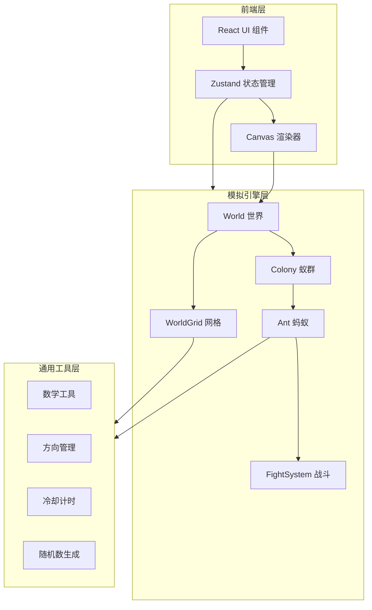
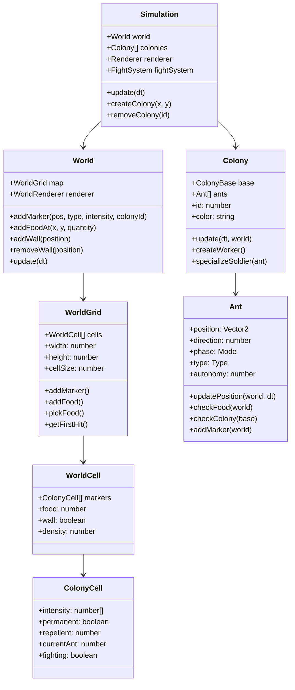

# AntSimulator Web 版 - 技术架构文档

## 1. 架构设计



## 2. 技术说明

- **前端框架**：React 18 + TypeScript + Vite
- **样式方案**：Tailwind CSS 3
- **状态管理**：Zustand
- **渲染引擎**：HTML5 Canvas 2D（高性能批量渲染）
- **构建工具**：Vite
- **图标库**：lucide-react
- **后端**：无（纯前端应用）

## 3. 路由定义

| 路由 | 用途 |
|------|------|
| / | 模拟主页面，包含世界渲染和控制面板 |

## 4. 核心数据结构

### 4.1 模拟引擎类图



## 5. 项目目录结构

```
src/
├── components/          # React UI 组件
│   ├── ControlPanel.tsx      # 控制面板
│   ├── EditToolbar.tsx       # 编辑工具栏
│   ├── ColonyInfo.tsx        # 蚁群信息卡片
│   ├── DisplayOptions.tsx    # 显示选项
│   └── ParameterSlider.tsx   # 参数滑块
├── simulation/          # 模拟引擎核心
│   ├── Simulation.ts         # 模拟主控
│   ├── World.ts              # 世界
│   ├── WorldGrid.ts          # 世界网格
│   ├── Colony.ts             # 蚁群
│   ├── Ant.ts                # 蚂蚁
│   ├── AntUpdater.ts         # 蚂蚁更新器
│   ├── WorkerUpdater.ts      # 工蚁更新器
│   ├── SoldierUpdater.ts     # 兵蚁更新器
│   ├── FightSystem.ts        # 战斗系统
│   ├── ColonyBase.ts         # 蚁群基地
│   ├── Config.ts             # 配置
│   └── types.ts              # 类型定义
├── render/              # 渲染模块
│   ├── Renderer.ts           # 主渲染器
│   ├── WorldRenderer.ts      # 世界渲染器
│   └── ColonyRenderer.ts     # 蚁群渲染器
├── common/              # 通用工具
│   ├── math.ts               # 数学工具
│   ├── Direction.ts          # 方向管理
│   ├── Cooldown.ts           # 冷却计时
│   ├── Grid.ts               # 通用网格
│   └── RNG.ts                # 随机数生成
├── hooks/               # React Hooks
│   ├── useSimulation.ts      # 模拟循环 Hook
│   └── useCanvas.ts          # Canvas 渲染 Hook
├── store/               # Zustand 状态
│   └── useStore.ts           # 全局状态
├── pages/               # 页面
│   └── Simulator.tsx         # 模拟器主页面
├── App.tsx
└── main.tsx
```

## 6. 性能优化策略

1. **Canvas 批量渲染**：使用 `VertexArray` 模式批量绘制蚂蚁，减少 draw call
2. **空间分区**：保持原项目的网格分区优化，快速碰撞检测
3. **增量渲染**：只重绘变化区域
4. **requestAnimationFrame**：使用浏览器原生动画帧调度
5. **对象池**：复用蚂蚁对象，减少 GC 压力
6. **Web Worker**（可选）：将模拟计算移至 Worker 线程，避免阻塞 UI
